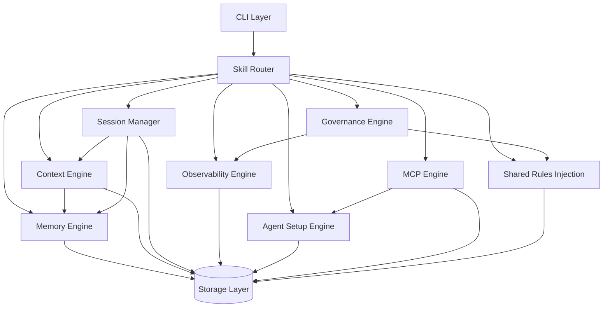

# Z-Core 整体架构

## 1. 设计原则

| # | 原则 | 含义 | 违反示例 |
|---|------|------|----------|
| P1 | **零常驻进程** | 没有 daemon，没有服务端。`zcore` 是 CLI 工具，调完即退 | 启动 background server |
| P2 | **Agent 无关** | 不绑定任何一个 Agent 的 API 或 SDK | 依赖 `@anthropic-ai/sdk` |
| P3 | **人类可审计** | 所有状态都是人类可读的文件（JSON/Markdown/TOML） | 用 SQLite 或二进制存储核心状态 |
| P4 | **渐进增强** | v1 的 skill 不改也能在 v2 下运行 | 强制所有 skill 重写 |
| P5 | **单一入口** | 所有操作通过 `zcore <cmd>` 完成 | 用户还需要直接调 python3 脚本 |
| P6 | **约定优于配置** | 合理默认值，高级用户可覆盖 | 每个功能都需配置才能用 |
| P7 | **隐私一等公民** | 数据默认脱敏再外发；支持纯本地模型 | 明文发送含密码的对话到第三方 API |
| P8 | **优雅降级** | Ghost Agent 是增强层不是必要层；无 API key 也能用 | Ghost Agent 不可用时整个系统瘫痪 |

## 2. 系统分层

```
┌─────────────────────────────────────────────────────┐
│                    CLI Layer                         │
│                  zcore <cmd>                       │
│                                                     │
│  zcore memory search "query"                      │
│  zcore compact --model sonnet                     │
│  zcore session end                                │
│  zcore run <skill> --args                         │
│  zcore status                                     │
└──────────────────────┬──────────────────────────────┘
                       │
┌──────────────────────▼──────────────────────────────┐
│                  Router Layer                        │
│                                                     │
│  命令解析 → Skill 匹配 → Hook 链 → 执行 → 结果     │
└──────────────────────┬──────────────────────────────┘
                       │
┌──────────────────────▼──────────────────────────────┐
│                  Engine Layer                        │
│                                                     │
|  ┌──────────┐ ┌──────────┐ ┌──────────┐            |
│  │ Context  │ │ Memory   │ │ Session  │            |
│  │ Engine   │ │ Engine   │ │ Manager  │            |
│  └──────────┘ └──────────┘ └──────────┘            |
│  ┌──────────┐ ┌──────────┐ ┌──────────┐            |
│  │ Skill    │ │ Govern-  │ │ Observ-  │            |
│  │ Router   │ │ ance     │ │ ability  │            |
│  └──────────┘ └──────────┘ └──────────┘            |
│  ┌──────────┐ ┌──────────┐ ┌───────────────────┐   |
│  │ Agent    │ │ MCP      │ │ Ghost Agent       │   |
│  │ Setup    │ │ Engine   │ │ (后台小模型)       │   |
│  └──────────┘ └──────────┘ └───────────────────┘   |
└──────────────────────┬──────────────────────────────┘
                       │
┌──────────────────────▼──────────────────────────────┐
│                  Storage Layer                       │
│                                                     │
│  ~/.zcore/          ~/.ai-memory/    ~/.lancedb/  │
│  ├── config.toml      ├── whiteboard   knowledge    │
│  ├── sessions/        ├── topics/                   │
│  ├── hooks/           └── config.json               │
│  └── logs/                                          │
└─────────────────────────────────────────────────────┘
```

## 3. 目录布局

命名冻结：
- 独立仓库名使用 `Z-Core`
- v2 Python package / distribution 冻结为 `zcore`
- CLI 命令冻结为 `zcore`
- v1 目录保持只读兼容，不在 Phase 0 中改造

```
~/.zcore/                      # v2 运行时主目录
├── config.toml                  # 全局配置
├── shared-rules.yaml            # 共享规则注入数据源（详见 shared-rules-injection.md）
├── mcp-servers.toml             # MCP Server 注册表（single source of truth）
├── sessions/                    # 会话快照
│   └── <session-id>/
│       ├── meta.json            # 会话元数据（agent, project, timestamps）
│       ├── context.json.gz      # 压缩后的上下文快照
│       └── memory-snapshot.json # 关联的记忆条目
├── hooks/                       # 全局 hooks
│   ├── pre-execute.d/           # 执行前 hook 脚本
│   └── post-execute.d/         # 执行后 hook 脚本
├── logs/                        # 运行日志
│   ├── executions.jsonl         # skill 执行日志
│   └── costs.jsonl              # API 成本日志
└── cache/                       # 临时缓存
    └── token-estimates/         # token 估算缓存

~/.ai-memory/                    # v1 兼容，保留
├── config.json                  # 记忆配置（含 l3_paths）
├── whiteboard.json              # v1 的 L2（保留向后兼容）
└── topics/                      # v2 新增：按主题独立记忆文件
    ├── user-preferences.md
    ├── project-conventions.md
    └── ...

~/.ai-skills/                    # Skill 安装目录（v1 兼容）
├── memory-manager/
├── context-engine/              # v2 新增
├── session-manager/             # v2 新增
└── ...
```

## 4. 配置文件

```toml
# ~/.zcore/config.toml

[core]
version = "2.0"

[llm_backend]
# Ghost Agent 配置：为底层自动化提供廉价算力
enabled = true                        # false = 完全禁用，退化为无 LLM 模式
provider = "google"                   # google | anthropic | openai | deepseek | ollama
model = "gemini-2.5-flash"
# api_key 优先从环境变量 ZCORE_LLM_API_KEY 读取
# 如果未设环境变量，从此处读取（不推荐，文件权限必须 600）
# api_key = ""
endpoint = ""                         # Ollama 或自定义 endpoint
timeout = 30                          # API 超时秒数
monthly_budget = 5.00                 # 月度预算上限（美元），0 = 无上限
retry_max = 2                         # 失败重试次数
fallback_on_failure = true            # 失败时降级为非 LLM 模式

[privacy]
redact_before_send = true             # 发送前脱敏（默认开启）
redact_patterns = [                   # 自定义脱敏正则
  "(?i)(api[_-]?key|token|secret|password)\\s*[=:]\\s*\\S+",
  "sk-[a-zA-Z0-9]{20,}",
  "AIza[a-zA-Z0-9_-]{35}",
]
redact_file_paths = true              # 替换路径中的用户名为 [USER]

[memory]
auto_extract = true               # 会话结束时自动提取记忆
dedup_threshold = 0.85            # 语义去重阈值
max_l2_entries = 500              # L2 条目上限
topic_storage = true              # 按主题独立文件存储

[context]
auto_compact = true               # 上下文超限时自动压缩
compact_threshold_pct = 80        # 占上下文窗口百分比时触发
buffer_tokens = 13000             # 压缩保留缓冲区

[session]
auto_snapshot = true              # 会话结束时自动快照
snapshot_retention_days = 30      # 快照保留天数
enable_handoff = true             # 允许跨 Agent 会话续接

[governance]
permission_mode = "ask"           # ask | allow | deny
hooks_enabled = true              # 是否启用生命周期 hooks

[observability]
cost_tracking = true              # API 成本追踪
execution_logging = true          # Skill 执行日志
health_reports = true             # 定期健康报告

[paths]
memory_dir = "~/.ai-memory"
skills_dir = "~/.ai-skills"
knowledge_db = "~/.lancedb/knowledge"
```

## 5. 引擎间依赖关系



**关键依赖规则**：
- Context Engine 可以独立运行（纯函数式压缩）
- Memory Engine 可以独立运行（v1 兼容）
- Session Manager 依赖 Context + Memory
- Governance 依赖 Observability（权限违规要记录）
- Shared Rules Injection 依赖 Governance（行为清单）+ Skill Router（安装校验）
- 所有引擎通过 Storage Layer 共享状态
- **Ghost Agent 降级规则**：
  - Level 0：Ghost Agent 可用 → 正常 LLM 压缩/提取
  - Level 1：API 不可用 → 启发式提取（关键词 + 结构化数据保留）
  - Level 2：提取也失败 → 原始对话 gzip 保存，下次补做处理
  - 原则：**永不丢失数据，永不阻塞用户**

## 6. Python 包结构

```
zcore/                          # Python package root
├── __init__.py
├── __main__.py                   # python -m zcore 入口
├── __version__.py                # 版本号 0.2.0
├── cli/
│   ├── __init__.py
│   └── main.py                   # argparse CLI（40 个命令，全覆盖）
├── engines/
│   ├── __init__.py
│   ├── context.py                # Context Engine
│   ├── memory.py                 # Memory Engine
│   ├── session.py                # Session Manager
│   ├── router.py                 # Skill Router（三层路由 + install/validate）
│   ├── governance.py             # Governance Engine（权限规则 + shell 分类）
│   ├── observability.py          # Observability Engine（成本追踪 + 健康报告）
│   ├── agent_setup.py            # Agent Setup Engine（检测 + 标记块注入）
│   ├── mcp.py                    # MCP Engine（注册表 + diff + sync）
│   ├── workflow.py               # Workflow Engine（TOML → discover/validate/run）
│   └── ghost_agent.py            # Ghost Agent (API直连封装)
├── models/                       # 数据模型
│   ├── __init__.py
│   ├── session.py                # SessionMeta（含 pause/resume 状态）
│   ├── memory.py                 # MemoryEntry（4 类分类 + expired）
│   ├── skill.py                  # SkillManifest + 激活/权限/IO 配置
│   ├── mcp.py                    # McpServer + McpSyncResult
│   └── workflow.py               # WorkflowDefinition, StepResult, WorkflowResult
├── hooks/                        # Hook 框架
│   ├── __init__.py
│   ├── lifecycle.py              # HookRunner + 自定义 hook 脚本加载
│   └── builtin.py                # 内置 hooks（validate-input/check-permissions/log-execution）
├── utils/
│   ├── __init__.py
│   ├── tokens.py                 # Token 估算
│   ├── prompts.py                # Prompt 模板加载
│   ├── frontmatter.py            # stdlib YAML frontmatter 解析
│   ├── fs.py                     # 文件操作工具（原子写入）
│   ├── filelock.py               # 基于 lockfile 的文件锁
│   ├── privacy.py                # 数据脱敏处理
│   └── time.py                   # 时间窗口解析（d/h/w/m）
├── compat/                       # v1 兼容层
│   ├── __init__.py
│   └── legacy_skills.py          # 兼容 v1 skill 调用
├── config.py                     # config.toml 渲染/加载/set/reset/掩码
├── runtime.py                    # RuntimePaths discover（环境变量覆盖）
├── paths.py                      # 路径辅助
└── prompts/                      # Prompt 模板
    ├── compact.md                # 压缩 prompt
    ├── memory_extract.md         # 记忆提取 prompt
    └── session_handoff.md        # 会话交接 prompt
```

## 7. 安装方式

```bash
# 或从源码安装（开发模式）
cd /path/to/Z-Core && pip install -e .

# 初始化
zcore init
# → 创建 ~/.zcore/config.toml
# → 创建基础运行时目录
```

## 8. v1 → v2 迁移路径

| v1 | v2 | 迁移方式 |
|----|-----|----------|
| `~/.ai-memory/whiteboard.json` | `~/.ai-memory/topics/*.md` | `zcore migrate` 自动拆分 |
| `~/.ai-memory/config.json` | `~/.zcore/config.toml` | 合并到新配置 |
| `python3 ~/.ai-skills/xxx/scripts/yyy.py` | `zcore <cmd>` | CLI 包装器 |
| `core-skills/` 下的 skill | 后续注册到 `zcore` CLI | 自动发现 |
| 无运行时 | `zcore` CLI + hooks | 新增 |
